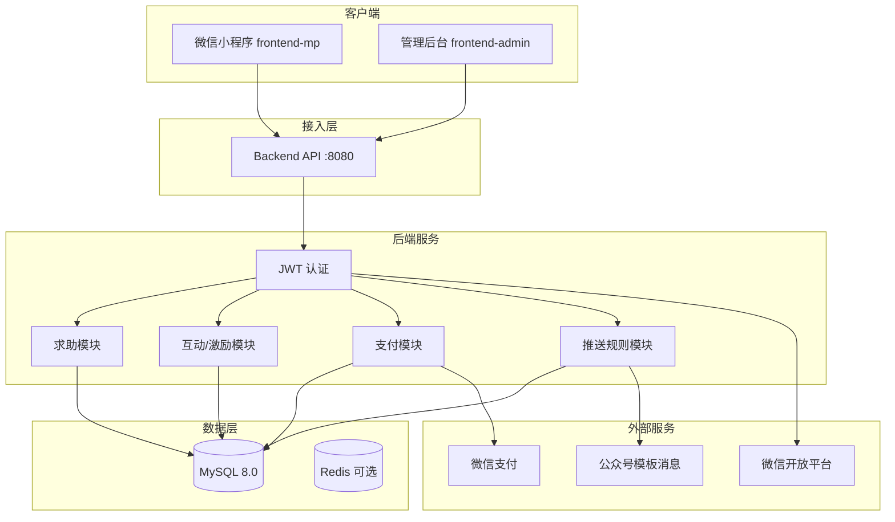
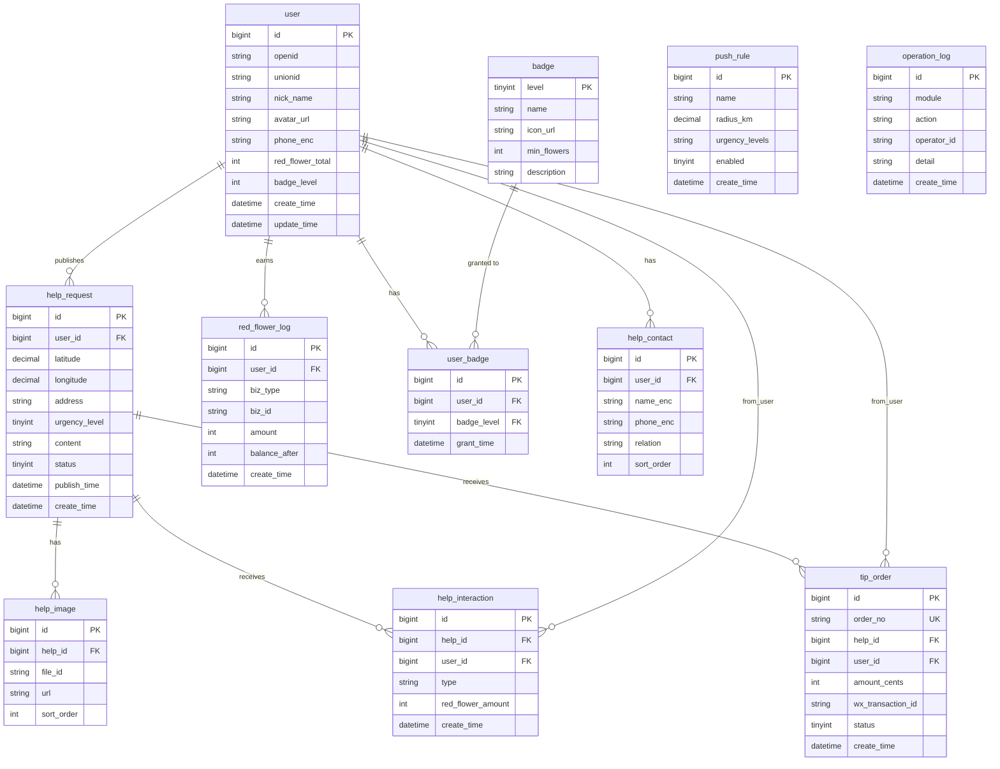

# 紧急求助互助小程序 - 项目设计文档

## 1. 系统架构

## 2. ER 图

## 3. 接口清单

### 3.1 认证 (AuthController)
| 方法 | 路径 | 说明 |
|-----|------|------|
| POST | /api/mp/auth/login | 小程序 code 换 openid/session，返回 JWT |
| GET  | /api/mp/auth/profile | 获取当前用户信息 |
| PUT  | /api/mp/auth/profile | 更新昵称/头像/手机/隐私设置 |

### 3.2 求助 (HelpController)
| 方法 | 路径 | 说明 |
|-----|------|------|
| POST | /api/mp/help | 发布求助（位置、紧急程度、描述、图片、联系人） |
| GET  | /api/mp/help/{id} | 求助详情 |
| GET  | /api/mp/help/list | 首页列表（分页） |
| GET  | /api/mp/help/nearby | 附近的求助（经纬度+半径） |
| GET  | /api/mp/help/my | 我发布的求助 |

### 3.3 互动 (InteractionController)
| 方法 | 路径 | 说明 |
|-----|------|------|
| POST | /api/mp/interact/bless | 祝福（+1 小红花） |
| POST | /api/mp/interact/share | 转发记录（+2 小红花） |
| POST | /api/mp/interact/tip | 发起打赏（创建订单） |

### 3.4 打赏/支付 (TipController)
| 方法 | 路径 | 说明 |
|-----|------|------|
| POST | /api/mp/tip/create | 创建打赏订单，返回 wx pay params |
| POST | /api/mp/tip/notify | 微信支付异步回调（验签、落库、小红花） |
| GET  | /api/mp/tip/records | 打赏记录 |

### 3.5 小红花与勋章 (FlowerController)
| 方法 | 路径 | 说明 |
|-----|------|------|
| GET  | /api/mp/flower/summary | 当前用户小红花总数、勋章等级 |
| GET  | /api/mp/flower/logs | 小红花收支明细 |
| GET  | /api/mp/badge/list | 勋章等级列表与晋升规则 |
| GET  | /api/mp/badge/my | 当前用户勋章墙 |

### 3.6 常用联系人 (ContactController)
| 方法 | 路径 | 说明 |
|-----|------|------|
| GET  | /api/mp/contacts | 我的紧急联系人列表 |
| POST | /api/mp/contacts | 新增联系人 |
| PUT  | /api/mp/contacts/{id} | 更新 |
| DELETE | /api/mp/contacts/{id} | 删除 |

### 3.7 个人助人经历 (ExperienceController)
| 方法 | 路径 | 说明 |
|-----|------|------|
| GET  | /api/mp/experience/timeline | 帮助记录时间轴（祝福/转发/打赏） |
| GET  | /api/mp/experience/thanks | 收到的感谢列表 |

### 3.8 管理端 (Admin)
| 方法 | 路径 | 说明 |
|-----|------|------|
| POST | /api/admin/auth/login | 管理员登录 |
| GET  | /api/admin/help/list | 求助列表、审核 |
| GET  | /api/admin/user/list | 用户列表 |
| GET  | /api/admin/push/rules | 推送规则列表 |
| POST | /api/admin/push/rules | 新增/更新推送规则 |
| POST | /api/admin/push/trigger | 触发一次推送（测试或定时） |

## 4. UI/UX 规范

- **主色调**：温暖色系。主色 `#E85D3A`（暖橙），辅助色 `#F5A623`（琥珀），背景 `#FFF8F5`，卡片背景 `#FFFFFF`，阴影 `0 2px 12px rgba(232,93,58,0.08)`。
- **字体**：标题 18px/600，正文 14px/400，辅助 12px/400；颜色 主文字 `#333`，次要 `#666`，提示 `#999`。
- **圆角**：卡片 12px，按钮 8px，输入框 8px。
- **间距**：页面边距 16px，卡片内边距 16px，组件间距 8px/16px/24px 统一。
- **紧急程度**：高-红，中-橙，低-黄；配图标与标签。
- **底部导航**：首页、发布求助（悬浮突出）、附近的求助、个人中心；点击反馈 ≤300ms，有选中态。
- **交互**：按钮 Hover/Loading；成功/失败统一 Toast；图片占位、图标用 Icon 组件，无破损。
- **登录**：不出现“账号密码”提示，采用微信一键登录。

## 5. 技术要点

- **性能**：求助列表/附近接口加索引，响应目标 ≤500ms；前端首屏 ≤1.5s；高并发通过连接池、异步回调、后续可加 Redis 缓存。
- **安全**：敏感字段加密存储（手机、联系人）；位置授权与匿名化选项；JWT + 请求校验；支付回调验签。
- **合规**：打赏流程符合微信支付规范；交易记录与对账字段完整；推送内容符合公众号规范。
